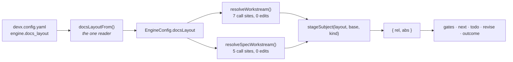
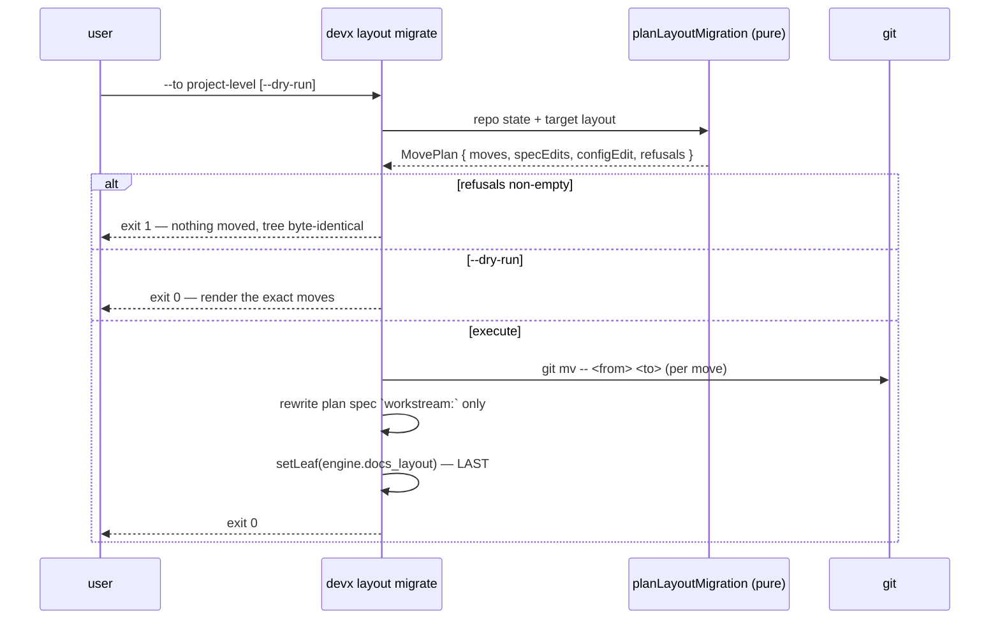

# Design (human digest) — Docs Layout Resolution

> Authoritative artifact: `design/agent.md`. Conflicts resolve there.

## Reading guide

| Section | What it covers | pm | architect | dev | qa |
| --- | --- | :-: | :-: | :-: | :-: |
| Overview | What breaks today, and the two moves that fix it | ● | ● | ● | ● |
| The artifact map | Where does a given artifact live, under either shape? | | ● | ● | ● |
| Threading the layout through `EngineConfig` | How does the layout reach a resolver without touching 12 call sites? | | ● | ● | |
| Layout-aware workstream resolution | What does a hash resolve to when there are no folders? | | ● | ● | ○ |
| Layout-aware scaffolding | Why does `workstream new` refuse itself today, and what fixes it? | ○ | ○ | ● | ● |
| `devx layout migrate` | How does a mid-flight tree move without losing passed gates? | ● | ● | ● | ● |
| Guard discrimination | How do we tell a legacy repo from a flat-layout one? | | ● | ● | ● |
| Closing the remaining bypasses | Which existing sites resolve behind the resolver's back? | | ○ | ● | ● |
| Correcting the two false doc claims | What do the docs say now, and how does prose get test-asserted? | ● | | ● | ● |
| Migration plan | What order does the world change in, and what proves it worked? | ● | ○ | ● | ● |
| Constraints · Trade-offs · Risks | What was fixed, what was chosen, what could still go wrong | ● | ● | ○ | ● |

## Overview

`engine.docs_layout` is a two-valued config key that today chooses almost
nothing. It has **one** production consumer — `devx outline init`. All four
gates, `devx next`, `todo sync`, `revise` and `outcome` resolve artifacts by
joining a hardcoded workstream-shaped constant onto a directory, so
`project-level` is not a layout at all: it is a protected filename set that no
gate can ever reach. Two shipped documents assert the opposite.

Two moves fix most of it:

1. **The layout becomes a field on `EngineConfig`.** Every one of the seven
   `resolveWorkstream` call sites and five `resolveSpecWorkstream` call sites
   already threads a whole `EngineConfig` object from `loadEngineContext`. So
   the layout arrives at the resolver with **zero** signature churn at any
   consumer. This is the whole reason the design is cheap.
2. **One artifact map** (`stageSubject()`) owns every `(layout, base, kind) →
   path` decision, replacing per-call-site path joining.

The rest is a layout branch in workstream resolution and scaffolding, a new
`devx layout migrate`, and a discriminator on three guards that currently read a
root `prd.md` as proof of an unmigrated repo.

## The artifact map

One union (`ArtifactKind` — genuinely new; there is no artifact-kind type
today) and one function returning **both** the repo-relative display form and
the absolute path, because both are needed at the same call sites: refusal
messages print `rel`, reads use `abs`.

**11 union variants render as the §15 table's 13 rows** — `agent` expands to
three (prd/design/plan), three stage-parametrized companions, seven singletons.
Two of the thirteen (`checkpoints/`, `RESULTS.md`) are rows §15 lacks today.

| Kind | `workstream` | `project-level` |
|---|---|---|
| agent · prd / design / plan | `<ws>/prd/agent.md` | `prd.md` |
| human · `<stage>` | `<ws>/<stage>/human.md` | `<stage>-human.md` |
| outline · `<stage>` | `<ws>/<stage>/outline.md` | `<stage>-outline.md` |
| outline-critique · `<stage>` | `<ws>/<stage>/outline-critique.md` | `<stage>-outline-critique.md` |
| expectations · todo · results | `<ws>/expectations.md` | `expectations.md` |
| evals · decisions · checkpoints dirs | `<ws>/evals` | `evals` |
| red-report | `<ws>/evals/RED-report.md` | `evals/RED-report.md` |

**The sharp edge is `evals`** — and the type disarms it rather than branching on
it. Its *subject* is a directory while its *companions* are hyphen-prefixed root
files (`evals-human.md`, `evals-outline.md`). So `agent` is narrowed to
`SubjectStage = "prd" | "design" | "plan"`, making "the evals stage's agent
document" **unrepresentable**; the directory is reached as
`{ kind: "evals-dir" }`, which is what it actually is. Nothing exercises any of
this today, so the map must be tested at `evals` specifically.

**Closing the bypass class structurally.** `stageSubject()` becomes the only
*exported* way to reach a path, and the `*_REL` constants go module-private —
the compiler enforces what a grep is currently being asked to notice.

**The blast radius is ~15 modules and 40+ sites**, and this design said "two
consumers, both dissolve" in an earlier draft. That was wrong by an order of
magnitude. Stated honestly:

| Consumer class | Needs |
|---|---|
| `gate-prd.ts` finding `location:` fields (~10) | layout threaded into functions receiving neither today — **the single largest mechanical cost here** |
| Refusal / subject / row-reason / outcome messages (~25, across `gate*.ts`, `next.ts`, `outcome.ts`, `render.ts`) | `subject.rel` |
| `todo-truth.ts:37` `export const TODO_FILENAME = TODO_REL` | a **re-export** — privatizing `TODO_REL` breaks two call sites at compile time |
| `CASCADE_TABLE` keys | re-key on `ArtifactKind` |

Two traps that follow, both easy to ship broken:

- **`KNOWN_ARTIFACTS`** (`revise.ts:67`) maps the table to `e.artifact` and is
  joined into user-facing text. Re-keying on `ArtifactKind` renders it
  `[object Object]`. The table keeps a `display` projection.
- **`cascadeFor()` matches raw path spellings too**, not just the shorthand — so
  the re-key needs a path → `ArtifactKind` reverse lookup accepting *both*
  layouts' spellings, so `--touched design.md` still resolves on a folder-layout
  repo.

The gate `location:` change touches no verdict, so E-1 is unaffected. The scan
survives only for literal basenames in shipped-template paths and genuinely
layout-independent message text.

**The nine `*Abs()` helpers are a second, larger blast radius: ~51 call sites.**
`prdAbs(wsAbs)` and its siblings join a constant onto a workstream directory —
layout-blind by construction, and `stageSubject()` can't be fed by that
signature. They survive as **layout-aware wrappers**, taking the resolved base
(`{repoRoot, workstreamRel, layout}` — what `resolveWorkstream` already returns)
instead of a bare `wsAbs`. Every call site has that object already, so the edit
is mechanical — but Plan-stage sizing must carry 51 sites rather than discover
them.

This also dissolves an inconsistency an earlier draft carried: it called
`backfill.ts`'s `planAbs` "correct" while calling `next.ts`'s structurally
identical `prdAbs` probes "broken." Under `project-level`, `planAbs(repoRoot)`
is exactly as wrong as `prdAbs(repoRoot)`. Neither is a bypass; both are correct
calls into a layout-blind helper, fixed by the same signature change. What is
genuinely distinct about `backfill.ts` is only its *enumeration*.

## Threading the layout through `EngineConfig`

`docsLayout` becomes a fifth field, populated by delegating to
`docsLayoutFrom()` — never a second inline read.

**One ordering subtlety will bite a naive implementation.**
`engineConfigFrom()` opens with two early-return guards (non-object `merged`,
then non-object `merged.engine`). But `docsLayoutFrom()` reads *two* sections:
`engine.docs_layout` **and** the legacy `personalization["docs.layout"]`. A repo
whose only layout answer is the legacy key has no `engine:` block at all — so
the second guard fires and the layout is silently lost. The assignment must
happen **above both guards**. `docsLayoutFrom()` is already defensive on both
reads, which is what makes that safe.

Also collapsed here: `gather.ts:1160`'s private `docsLayoutUnset()` is
**deleted**, not fixed (it hand-duplicates the two-key read), and the duplicate
hand-written `DocsLayout` type at `init-questions.ts:58` becomes an import.

Deleting it is not enough on its own. Re-expressing its caller against a
*second exported predicate* would leave the count at two — the same drift bug
wearing a new name. G-2's metric is one **function**, not one **file**. So the
read happens once and returns both answers: `resolveDocsLayout(merged) →
{ layout, source }`, with `source: "engine" | "legacy" | "default"`.
`docsLayoutFrom()` becomes a thin wrapper that reads nothing, and `devx next`'s
nag becomes `source === "default"`.

## Layout-aware workstream resolution

Under `project-level` a hash resolves to `workstreamRel: "."` / `workstreamAbs:
repoRoot`. The existing directory-existence check passes with no special case,
because `join(repoRoot, ".")` is the repo root.

The part that must **not** run is the filename fallback: a spec with no
`workstream:` key currently derives `_devx/workstreams/scene-engine` from its
filename — a folder path in a repo with no folders. Rather than guarding four
call sites, `planFilenameWorkstreamRel()` changes signature to take the whole
`EngineConfig`. Four mechanical edits, and the layout stops being something four
sites must remember.

One honest consequence: `resolveSpecWorkstream`'s membership regex can never
match under `project-level`, so its `path-in-from-or-plan` arm is **dead**
there. That is fine — under this layout there is exactly one workstream, so any
spec with an engine `stage:` belongs to it. The arm is skipped, not repaired.

## Layout-aware scaffolding

**`project-level` refuses its own primary use case today.**
`createWorkstream`'s no-hash path throws when the workstream directory exists
and no spec claims it. Under `project-level` that directory *is* the repo root,
which always exists — so `devx workstream new` with no slug (UC-1, exactly) throws
on every invocation. The fix changes *what is probed*: not "does the directory
exist" but "is a doc set already present here". Under `workstream` the two
questions coincide, so behavior is unchanged.

Also: the inline three-entry template array becomes an iteration over artifact
kinds through `stageSubject()` — which relieves the existing triple-coupling
(result shape, template array, `noop` conjunction all change together for any
new artifact). And `[slug]` becomes optional under `project-level`, required
under `workstream` with an error naming the layout as the reason.

## `devx layout migrate`

`--dry-run` is non-destructive **by construction, not by care**: a pure planner
produces a `MovePlan`, and the command either renders it or executes it. No
`if (!dryRun)` sprinkled through the mover.

Three refusals, computed before any move: **≥2 live workstreams** (live =
`stage !== done && stage !== retired`, read from `plan/` specs — never from a
directory listing), **a doc set already at the destination**, and **a dirty
working tree**. They live in this command rather than in `resolveWorkstream`,
because only one caller in the whole repo distinguishes a refusal from a generic
error — a refusal added to the resolver would silently become exit 2 everywhere.

Only the plan spec's `workstream:` field is rewritten. `stage:`, `gate_status:`
and `gate_verdicts:` live in the spec, not the tree, so **passed gates survive by
construction** rather than by careful copying.

**Why config is written last — corrected.** The PRD says it keeps config
describing the tree on interruption. It does not: if the moves land and the
config write does not, config describes the *old* shape while the tree carries
the new one. Both orderings leave a mismatch. The real reason is recovery: the
clean-tree precondition makes every move revertible with one
`git checkout -- .`, and a config edit first would dirty the tree and destroy
exactly that. So the ordering stands and the rationale changes — and the
mismatch is made *detectable* by a new `layout-tree-mismatch` doctor finding
rather than assumed away.

## Guard discrimination

Three sites read a root `prd.md` as proof of an unmigrated flat-era repo. Under
`project-level` those same filenames are the *current* layout, so the layout
becomes the discriminator — today's meaning under `workstream`, inverted under
`project-level`.

- **`createWorkstream`'s flat-era refusal** — its stage list is a bare inline
  `["prd","design","plan"]` derived from no constant; becomes `STAGE_DIRS`-derived.
- **`doctor`'s `flat-era-workstream` detector** — beyond the discriminator, it
  hardcodes `_devx/workstreams` and ignores `engine.workstreams_root` entirely.
  Fixed while we are in there.
- **`revise.ts`'s `STAGE_SHORTHAND`** — the one where the obvious fix is wrong.
  It maps flat-era *names* to workstream-shaped *paths*; those names are
  byte-identical to the `project-level` spellings, so under that layout it
  resolves the right name to the **wrong path**.

  Swapping the target to `projectAgentRel(stage)` **breaks `devx revise`
  outright**: `cascadeFor()` resolves a shorthand by matching
  `e.artifact === shorthand` against `CASCADE_TABLE`, which is keyed on the
  `*_REL` constants. Swap the target and nothing matches, `cascadeFor()` returns
  `null`, and the command refuses on every invocation. Today's coincidence is
  load-bearing.

  The fix is one level up: **re-key `CASCADE_TABLE` on `ArtifactKind`** and
  resolve to paths only at the edges. `cascadeFor()` needs no layout parameter
  afterward, because it is comparing identities rather than spellings.

Added rather than discriminated: a **`layout-tree-mismatch`** doctor finding,
`fixable: false` (the repair touches real work), pointing at `devx layout
migrate`.

## Closing the remaining bypasses

The resolver makes the class unrepresentable *going forward*; four existing
sites still resolve behind its back. The PRD names three. The one it misses is
the busiest.

- **`todo-truth.ts:49`** (`loadTodoDoc`) — **not in the PRD's list**, and on the
  path of every `devx next` (`gather.ts:898`) and every `devx todo sync`
  (`todo.ts:91`). One import away from `todoAbs()`, not using it.
- **`todo.ts:86` · `mark-done.ts:525`** — same hand-join, and both assign to a
  local named `todoAbs`, **shadowing the real resolver export**. Auditing by
  grep finds what looks like correct usage. The locals get renamed.
  `mark-done.ts` fails silently rather than loudly: its output feeds the `/devx`
  Phase 8 staging list, so a wrong spelling drops the file from the commit.
- **`validate-emit.ts:184,306`** — the hardest, because the layout changes the
  *shape of the claim being validated*, not just a path. Under `project-level`
  `wsDirMarker` is `.` and the plan is `plan.md`, so a dev spec's `from:` claim
  changes shape too. Probe and matcher take their inputs from the same resolver
  so emitter and validator cannot disagree. Boundary anchoring stays (the
  `backup_devx/...` collision case is layout-independent).
- **`backfill.ts:312-318`** — the PRD files this as a hand-join; it isn't. The
  defect is the **enumeration**: it readdirs the workstreams root and
  early-returns when absent, so under `project-level` graph phase-ordering
  silently degrades to **empty** — no error, no warning, just a board missing
  its edges.

Five more sites only build **message text**, in two severities worth keeping
apart: `gather.ts:900` and `gate.ts:492,508` print workstream-shaped paths the
repo doesn't contain (a diagnostic naming a nonexistent file is worse than
none), while `render.ts:119,124` are **cosmetic only** — `RED_REPORT_REL` and
`DECISIONS_DIR_REL` are layout-identical, so they render `./evals/RED-report.md`
with just a stray `./`. An earlier draft filed both at the higher severity;
overclaimed. All five move onto `subject.rel`; only the first group is a
correctness fix.

**Not a bypass** — recorded so nobody "fixes" it: `todo.ts:94` is
`join(repoRoot, TEMPLATES_DIR, TODO_FILENAME)`, the shipped npm template path.
Layout-independent by construction. An earlier draft listed it; it is a false
positive and is excluded from the PRD revision.

### `devx next` and `devx outcome` — the two surfaces the hand-join list misses

Their defect isn't a hand-join: they call the resolvers *correctly*, and the
resolvers are layout-blind. A change set stopping at the four hand-joins would
leave both quietly broken.

- **`devx next` row selection** (`gather.ts:972-975`, `next.ts:292-295`) probes
  `prdAbs(wsAbs)` etc. to pick a stage row. Under `project-level` those resolve
  to `<repoRoot>/prd/agent.md`, which never exists — so **every probe fails and
  `devx next` says "PRD not yet authored" forever**, on a repo whose PRD is
  sitting at `prd.md`. This is UC-3's real failure mode and the most
  user-visible breakage in the workstream.
- **`devx next` row reasons** (`engine/next.ts:115-155`) interpolate `*_REL`
  into all six reasons. UC-3 wants "the same reasons as the folder shape" —
  numbers come free once selection is fixed; reasons need `subject.rel`.
- **`devx outcome`** (`outcome.ts:314,332`) resolves against `workstreamAbs`,
  and `:492` hand-builds `${ws.workstreamRel}/RESULTS.md` instead of calling
  `resultsAbs()`. `RESULTS.md` is also one of the two kinds §15 doesn't
  document — the one file with neither a resolver caller nor a doc row.

## Correcting the two false doc claims

A reader consults these *before* choosing a layout, so this is not cleanup — it
is the difference between a discoverable feature and a trap.

- **`docs/CONFIG.md` §15 rule 5** becomes true as written. §15 also gains the
  `devx layout migrate` invocation — the answer to "what does switching cost",
  which §15 currently raises and leaves hanging.

  **The artifact table is restructured, not merely extended** — and the PRD
  understates this. FR-8 says §15 "gains its two missing rows", implying 13. The
  real table today has **12** rows in a different shape: design's outline and
  critique share a row, plan's share another, there are no `design-human` /
  `plan-human` rows, and `RED-report.md` has none at all. Target is one row per
  `ArtifactKind`. Saying "gains two rows" and then asserting set-equality over
  the table would have shipped a test that cannot pass.
- **`_devx/config-schema.json:939`** restates rule 5 verbatim and is the one a
  reader hits via editor autocomplete rather than by opening a doc. Description
  rewritten; enum unchanged, so no schema version bump.

**How prose gets test-asserted** — the test never diffs prose. It asserts that
§15's table has a row for every `ArtifactKind` the resolver handles (parse the
table, enumerate the union, compare sets), that neither document claims
layout-aware resolution for a surface that resolves layout-blind, and that both
enums match `DOCS_LAYOUTS`. Same posture as the Reading Guide check: mechanical
where a machine can settle it, silent about phrasing.

## Migration plan

**devx itself stays on `workstream`** and is the regression surface — every
change must be a no-op for it. Only two edits touch the `workstream` path at
all (the `engineConfigFrom()` reordering and the
`planFilenameWorkstreamRel()` signature change), and both are
behavior-preserving there.

**ClassyLights (`b7e38f`, `scene-engine`)** is the real subject and the G-3
measurement: `stage: plan` with two already-passed gates that must survive, and
an unset layout currently resolving to a default nobody chose. Clean the tree →
`--dry-run` and read the moves → run for real → confirm `gate_status` /
`gate_verdicts` diff empty → `devx gate coverage b7e38f` runs to a verdict.

**Legacy-key repos** are carried by the `engineConfigFrom()` ordering fix. Without
it, a repo whose only layout answer is `personalization["docs.layout"]` and which
has no `engine:` block would silently flip to the default on upgrade. That is a
live regression the reordering prevents, not a hypothetical.

No data migration, no schema bump — the layout is a shape, not a stored format.

## Constraints

- **The layout is never a gate input** (§15 rule 5). Same content, same verdict,
  either shape. Only *subject resolution* branches; gate bodies never see the
  layout.
- **`WorkstreamRefusal` is caught by exactly one call site** — new refusals must
  live in their own command.
- **Outline files stay human-only in both layouts**; the guard stays a pure
  filename matcher with no config read.
- **Leaf-only config writes** — `engine.docs_layout` is a scalar, so it fits.

## Trade-offs

- **One map over per-kind resolver pairs** — a `projectPrdAbs()` beside every
  `prdAbs()` doubles the surface at every addition and puts the layout decision
  back at the call site, which is the defect being removed.
- **`workstream: .` over a null sentinel** — the field is already a
  repo-relative path in every spec, so `.` extends the type instead of
  overloading it.
- **Signature change on `planFilenameWorkstreamRel()`** over four guarded call
  sites — a layout-blind helper four sites must remember to guard is the same
  bug class as the four hand-joins.
- **Compiler enforcement over a scan, where it reaches** — with the residue
  named honestly rather than papered over.

## Risks

| Risk | Mitigation | Proven by |
|---|---|---|
| Migration half-moves, repo unresolvable | Refusals are pure and run before any `git mv`; clean tree makes moves revertible with one `git checkout` | **E-7**, **E-6** |
| Layout branch changes a verdict (layout becomes a gate input) | Only subject resolution branches; gate bodies get a resolved path | **E-1** |
| A future consumer hand-joins a path again | Representational defense first, scan for the residue | **E-3** |
| Two layout readers drift | Collapse to one; delete the second rather than fix it | **E-2** |
| `project-level` scaffolding refuses its own use case | Directory probe becomes a doc-set probe | **E-5** |
| Config and tree disagree after an interruption | Made detectable via a new doctor finding, not assumed away | **E-6**, **E-7** |
| Docs re-drift after this closes | Doc claims become test-asserted | **E-8** |

## PRD corrections routed through `devx revise`

Grounding contradicted four numbers in the PRD; the losing artifact gets updated
rather than silently diverged from:

- **FR-5 / E-3 baseline: 4 bypasses → at least 6.** The miss is
  `todo-truth.ts:49` (`loadTodoDoc`) — the highest-traffic of all, on the path of
  every `devx next`.
- **FR-5 miscategorizes `backfill.ts`** — it uses the resolver correctly; the
  real defect is the *enumeration*, which yields nothing under `project-level`.
- **G-2 baseline: 2 orphaned exports → 15.** The whole stage-parametrized half
  of `artifacts.ts` is unwired.
- **FR-2: "five callers" → seven** — which strengthens the PRD's bet.

Plus one addition: **UC-1 is blocked today**, which the PRD does not mention.
