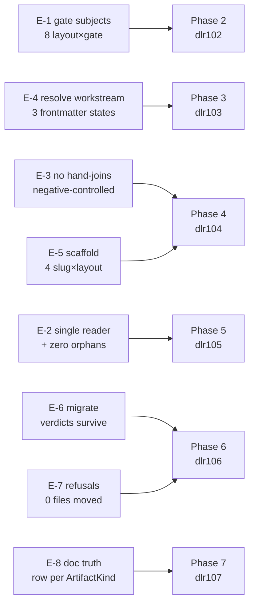

# RED — Docs Layout Resolution (human digest)

Gate 4 **PASS**, 2026-09-02. Eight evals, eight observed failing, all eight
recorded `right-reason`. Authoritative record: `RED-report.md`. Nothing here
is a gate input.

## What is now pinned

Every eval is a standalone `npx tsx` script under `evals/`, run by the
`workstream-evals` runner. Each asserts its own invariant **and** that its
companion `test/engine-layout-*.test.ts` exists — so the expectation also
lives in `npm test` and cannot quietly leave the suite.

## The three that carry the most weight

**E-1 is not an equality check.** Equality alone goes green the moment a
regression breaks both layouts identically — which is precisely the shape this
workstream is about to introduce. So all 8 combinations are pinned to an
absolute verdict (PASS on a good fixture, FAIL on a broken one), and every
path a `project-level` gate *prints* must exist on disk. A `location:` naming
`prd/agent.md` in a repo whose file is `prd.md` is a verdict difference
wearing a message's clothes.

**E-3 is negative-controlled, and the control runs first.** The scan asserts
zero hand-joins *globally*, never against a known list. Then it separately
asserts it still flags every live bypass and still does *not* flag the three
sites that only look like bypasses (`backfill.ts:350`, the two
template-SOURCE joins). Without that, an allowlist tuned against a stale list
can hide a real bypass and report a clean sweep — R-6, made executable by
authoring the scan in Phase 4 ahead of the closures it controls.

**E-6 does not claim to prove G-3.** The fixture proves the mechanism. The
evidence is the ClassyLights `b7e38f` run, which is cross-repo and
irreversible, and is owned by `MANUAL.md` MV-a494be.1.

## Three numbers the RED run corrected

The gate found real baselines that differ from what the PRD recorded. None
changes a phase; all three are recorded so `devx outcome` scores against
reality.

| Where | PRD/plan said | RED measured |
|---|---|---|
| Layout-key readers (E-2) | 2 | **3** — `init-write.ts:510` (`renderInitConfig`) is a third |
| Orphaned resolvers (E-2) | 2 | **8** — confirms the plan's R-9 correction |
| Hand-joined subject paths (E-3) | 4 | **15** distinct sites |

The reader count is new information: a regex-based scan silently blanked 40
lines of `init-write.ts` and hid it. The scan now runs on TypeScript's own
parser — see below.

## One thing worth knowing about the scanners

Three of these evals decide a P0 verdict by reading devx's own source. Two
hand-rolled versions were written and both silently mangled it — a regex sweep
let a comment opener inside a string swallow 40 lines, and a stateful walk
desynced on nested template literals. Both failed the same way: they blanked
real code and then reported **zero findings and GREEN**.

They now parse with `typescript` and throw `ScanDesync` rather than returning
a plausible-looking result, and every eval reports a desync as INFRA, not as a
finding. Verified across all 141 files in `src/`: no parse error, exact line
and column preservation.

## Not stamped

Gate 4 is supposed to freeze each eval's body under a sha in
`gate_status.red_eval_shas`. It did not, and could not: `stampEvalShas()` has
no caller anywhere in `src/`. Filed as `debug-75563d`. Until that lands, "fix
the code, not the eval" is a convention here, not a mechanism — worth knowing
before anyone edits one of these files during implementation.
