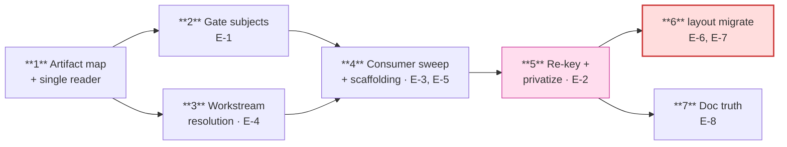

# Plan (human digest) — Docs Layout Resolution

> Authoritative artifact: `plan/agent.md`. Conflicts resolve there.
> Seven phases, four waves. Critique applied 2026-09-02 (pm/architect/dev/qa)
> — record in `decisions/2026-09-02-plan-critique.md`.

## The shape

`2 ∥ 3` and `6 ∥ 7` are parallel-safe. **5** is the riskiest phase (the only
compile break). **6** is a one-way door — it migrates a real repo.

## What each phase buys you

| # | Lands | You can then |
|---|---|---|
| **1** | `stageSubject()`, `ArtifactKind`, one layout reader, `EngineConfig.docsLayout` | nothing user-visible — it is the foundation everything else imports |
| **2** | gate subject resolution | run any gate under either layout and get the same verdict |
| **3** | `resolveWorkstream` returns the repo root under `project-level` | resolve a hash in a flat repo |
| **4** | every consumer on the resolver, + layout-aware `devx workstream new` | actually create and use a `project-level` repo |
| **5** | `CASCADE_TABLE` re-keyed, constants private | stop the bypass class from ever reopening |
| **6** | `devx layout migrate --to <layout>` | move an existing repo between shapes without losing gate state |
| **7** | §15 + schema tell the truth | trust the docs before choosing a layout |

## The three numbers worth knowing

- **33** `*Abs()` call sites and **72 lines / 93 occurrences** of the seven
  stage-shaped `*_REL` constants, across **17 modules**. The design estimated
  `~51` and `40+`; these are the grounded counts.
- **Five** hand-joins, not four — and only **one** of them
  (`validate-emit.ts`) is actually correctness-bearing. The `todo.md` trio
  produces correct paths today because that basename is layout-identical.
  They are closed anyway, so the next audit does not have to re-derive which
  ones were safe.
- **Two** flat-era guards, not three. `devx doctor`'s detector never reads a
  repo-root file, so it cannot misfire under `project-level`; its only defect
  is a hardcoded workstreams root.

## What could hurt

| | Risk | Why it matters |
|---|---|---|
| 🔴 | **Phase 6 is not revert-safe** | It `git mv`s and rewrites config in *your* repo. Reverting the devx PR does not un-migrate ClassyLights. `--dry-run` is the real mitigation; afterwards, rollback is a second migration the other way. |
| 🟠 | **Phase 5 is the compile break** | Privatizing the constants breaks a re-export chain and four test files, and re-keying `CASCADE_TABLE` changes what `devx revise` dispatches on. Cut small on purpose. |
| 🟠 | **`--touched design.md` must keep working in both layouts** | Legacy alias under `workstream`, current spelling under `project-level` — the same string arriving for two reasons. If a shorthand turns out genuinely ambiguous it refuses rather than resolving wrongly. |
| 🟡 | **Two stale expectation thresholds** | E-2 says "down from 2 orphans" (really 8); E-3 names a site that is not a bypass and omits one that is. Corrected in `decisions/2026-09-02-deferred-prd-corrections.md`; the RED evals are authored against that, and E-3's scan must be negative-controlled. |

## Two things that need you

- **MANUAL MV-a494be.1** (filed in Phase 6) — the real ClassyLights `b7e38f`
  migration. It is G-3's only evidence, it is cross-repo, and it cannot live
  inside a devx PR. Dry-run first, read the moves, then run it.
- **Seven phases, not the six you picked.** The critique found the original
  Phase 4 too big to review and found that shipping the scaffolder early made
  a risk reachable. Both fixes pointed the same way, so the sweep and the
  identity change are now separate. Collapsing them back is a one-paragraph
  edit if you'd rather have six.

## Deliberately not here

The **skill bodies still hardcode the folder shape** —
`.claude/commands/devx-plan.md` (6 refs) and `devx.md` (3). Under
`project-level` an agent would write the folder shape while the CLI reads the
flat one: the same reader/writer split this workstream exists to kill, one
layer out. It is out of scope because the prose budget (60KB, CI-gated) has
almost no headroom, so rewording nine references is its own sized piece of
work — **filed as a follow-up spec in T7.4**, not left to be discovered.

Also out: `dev-lay101`'s one-doc-set rule (phases 4 and 6 carry a local
predicate with its signature, deleted on adoption), the outline guard, a third
layout, and migrating devx itself.
