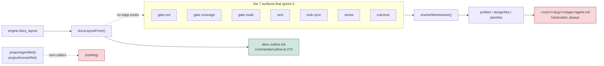
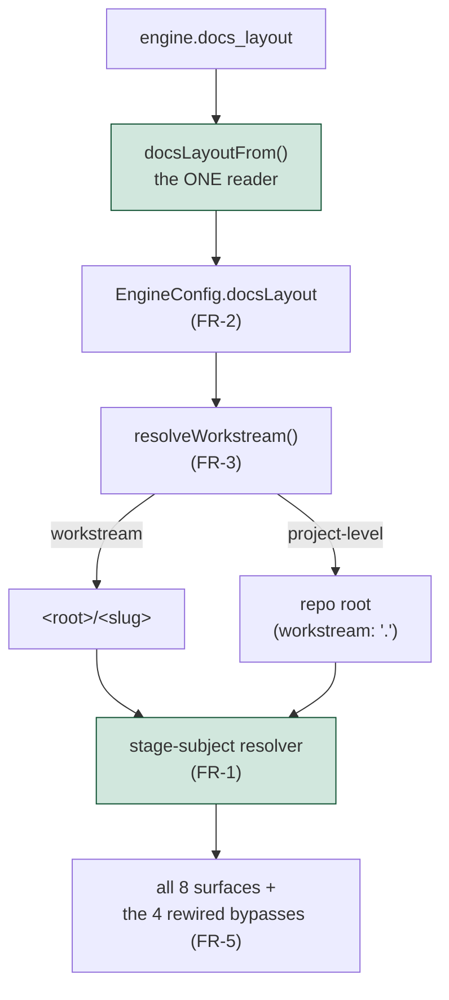

<!-- human.md — the succinct human-readable digest of this stage. Mermaid
     first, prose second; every diagram must carry real content, not
     decoration. When <stage>/outline.md exists its structure IS this file's
     structure (the outline dictates the shape; agent.md keeps the gate
     sections). Refreshed by the stage before its gate runs. -->

# prd — Docs Layout Resolution (human digest)

## Where the layout key actually reaches today

One consumer. Seven surfaces resolving past it. Two purpose-built
project-level resolvers with no callers at all. `project-level` is not a
layout today — it is a protected filename set that the outline guard
recognizes and nothing else honors.

Two shipped documents say otherwise: `docs/CONFIG.md` §15 rule 5 and
`_devx/config-schema.json:939` both claim gates already resolve through the
layout. Both are false, and both are what a reader consults before choosing.

## What the wiring looks like after

The unlock is that `workstream:` is **already** a repo-relative path in every
existing spec — `_devx/workstreams/scene-engine`, never a bare slug. So
`project-level` holds `.`, `join(repoRoot, ".")` is the repo root, and the
existing directory-existence check passes with no special case. And because
all five `resolveWorkstream` callers already thread an `EngineConfig`, putting
the layout on that struct delivers it everywhere with no signature churn.

## The four decisions taken (2026-09-01)

| Question | Taken | Because |
| --- | --- | --- |
| What does `workstream:` hold with no slug? | `.` | The field is already a path; extends the type instead of overloading `null` |
| Flat-era and project-level are identical on disk — how to tell them apart? | The layout is the discriminator | Free; the accepted hole is recorded under Open questions |
| How does a project-level repo start a doc set? | `devx workstream new`, slug optional under that layout | One entry point; no hollow prompt for a value the layout discards |
| What migrates ClassyLights? | `devx layout migrate --to <layout>` | Dedicated, human-invoked, `git mv`; `doctor --fix` must not move artifacts (`lay101`) |

## What this does not touch

The **outline guard stays layout-blind on purpose.** `isProtectedOutlinePath()`
is a pure filename matcher with no config read, so the human-only guarantee
cannot fail open on a malformed config. Making it layout-aware would be a
regression, not a completion.

Also out: `dev-lay101`'s one-doc-set enforcement (filed, adjacent, consumed
if it lands first); a third layout; any change to what a gate checks; and
migrating devx itself, which has nine live workstreams and stays on
`workstream`.

## The migration case is real, not hypothetical

ClassyLights `b7e38f` / `scene-engine`: `stage: plan`, with `prd_validated`
and `design_verified` already **PASSED**, `engine.docs_layout` unset. Eight
files on disk. It is the only repo that would exercise the new layout
end-to-end, and it cannot move today — which is why FR-7 is in scope rather
than filed as a follow-up.

Gate verdicts survive migration by construction: `stage:`, `gate_status:` and
`gate_verdicts:` live in the plan spec's frontmatter, not in the tree.

## Goals, in one line each

- **G-1** — 8 of 8 artifact-resolving surfaces honor the layout, from 1 of 8.
- **G-2** — 1 function reads the layout key (from 2); 0 orphaned resolvers (from 2).
- **G-3** — ClassyLights migrates with 0 lost verdicts, 0 hand-edits, 0 manual `git mv`.
- **G-4** — 0 shipped documents claiming resolution that does not exist (from 2).

All dated 2026-09-30. Eight expectations, seven of them P0; every one has a
runnable `test/engine-layout-*.test.ts` target.
